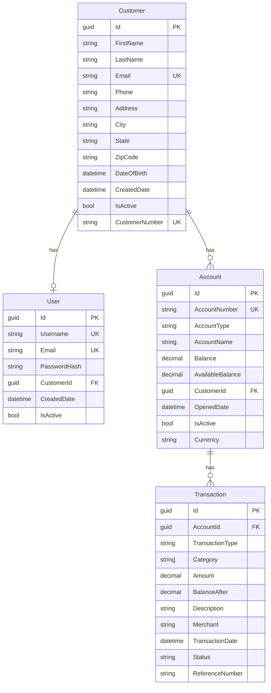

# Three Rivers Bank - Demo Application

A retail banking demo application built with .NET 10 and React, designed for GitHub Copilot demos.


## 🏦 About

Three Rivers Bank is a fictional retail banking application that demonstrates modern web development practices. It features a .NET 10 backend API and a React frontend with TypeScript.

## 🛠️ Tech Stack

### Backend
- **.NET 10** - Latest .NET framework
- **C#** - Primary programming language
- **Minimal APIs** - Modern API design pattern
- **Entity Framework Core** - ORM for data access
- **SQLite In-Memory** - Lightweight database for demo purposes

### Frontend
- **React 18** - UI library
- **TypeScript** - Type-safe JavaScript
- **Vite** - Fast build tool
- **React Router** - Client-side routing
- **Axios** - HTTP client

## 📁 Project Structure

```
banking-dotnet-demo/
├── backend/
│   └── Api/
│       ├── Models/
│       │   ├── Account.cs
│       │   ├── Customer.cs
│       │   ├── Transaction.cs
│       │   └── User.cs
│       ├── Services/
│       │   ├── Data/
│       │   │   ├── BankingDbContext.cs    # EF Core DbContext
│       │   │   └── DatabaseSeeder.cs      # Seed data initialization
│       │   ├── Interfaces/
│       │   │   ├── IAccountService.cs
│       │   │   ├── IAuthService.cs
│       │   │   ├── ICustomerService.cs
│       │   │   └── ITransactionService.cs
│       │   ├── AccountService.cs          # Account domain operations
│       │   ├── AuthService.cs             # Authentication operations
│       │   ├── CustomerService.cs         # Customer domain operations
│       │   └── TransactionService.cs      # Transaction domain operations
│       └── Program.cs
│   └── Api.Tests/
│       ├── TestDatabaseFactory.cs         # Test database setup
│       └── Services/
│           ├── AccountServiceTests.cs
│           ├── AuthServiceTests.cs
│           ├── CustomerServiceTests.cs
│           └── TransactionServiceTests.cs
├── frontend/
│   └── ui/
│       ├── src/
│       │   ├── components/
│       │   ├── pages/
│       │   ├── services/
│       │   └── types/
│       └── package.json
└── README.md
```

## 🏛️ Service Architecture

The backend follows a **domain-driven modular architecture** with four main services:

| Service | Responsibility |
|---------|----------------|
| `AuthService` | User authentication and login validation |
| `CustomerService` | Customer lookup, profile management |
| `AccountService` | Account queries, balance summaries |
| `TransactionService` | Transactions, transfers, deposits, withdrawals |

### Data Layer

The application uses **Entity Framework Core** with **SQLite in-memory database**:

| Component | Description |
|-----------|-------------|
| `BankingDbContext` | EF Core DbContext with entity configurations |
| `DatabaseSeeder` | Initializes the database with demo data on startup |

The SQLite in-memory database is created fresh on each application start, seeded with demo customers, accounts, and transactions. This approach provides:
- Real database operations with SQL queries
- Transaction support for data integrity
- Easy testing with isolated database instances
- No external database dependencies

### Database Schema



## 🚀 Getting Started

### Prerequisites
- [.NET 10 SDK](https://dotnet.microsoft.com/download)
- [Node.js 18+](https://nodejs.org/)
- npm or yarn

### Running the Backend

```bash
cd backend/Api
dotnet run
```

The API will start at `http://localhost:5000`

### Running the Frontend

```bash
cd frontend/ui
npm install
npm run dev
```

The frontend will start at `http://localhost:5173`

## 📡 API Endpoints

### Authentication
- `POST /api/auth/login` - User login (returns customer ID on success)

### Customers
- `GET /api/customers` - Get all customers
- `GET /api/customers/{id}` - Get customer by ID
- `GET /api/customers/{id}/profile` - Get customer profile with accounts

### Accounts
- `GET /api/customers/{id}/accounts` - Get customer accounts
- `GET /api/accounts/{id}` - Get account by ID

### Transactions
- `GET /api/accounts/{id}/transactions` - Get account transactions
- `GET /api/transactions/{id}` - Get transaction by ID

### Banking Operations
- `POST /api/transfer` - Transfer funds between accounts
- `POST /api/deposit` - Deposit funds
- `POST /api/withdraw` - Withdraw funds

### Health Check
- `GET /health` - API health status

## 👥 Demo Customers

The application comes with three pre-configured demo customers with login credentials:

| Customer | Username | Email | Password | Customer Number |
|----------|----------|-------|----------|-----------------|
| Sarah Johnson | sarah.johnson | sarah.johnson@email.com | password123 | TRB-100001 |
| Michael Chen | michael.chen | michael.chen@email.com | password123 | TRB-100002 |
| Emily Rodriguez | emily.rodriguez | emily.rodriguez@email.com | password123 | TRB-100003 |

**Note:** Users can login with either their username or email address.

**Default demo user:** Sarah Johnson (ID: `11111111-1111-1111-1111-111111111111`)

## 🔐 Authentication

The application includes a simple authentication system:

1. **Login Endpoint**: `POST /api/auth/login`
   - Accepts username/email and password
   - Returns customer ID and name on successful authentication
   - Returns 401 Unauthorized for invalid credentials

2. **Password Storage**: 
   - Passwords are hashed using SHA256 (for demo purposes)
   - In production, use proper password hashing like BCrypt or PBKDF2

**Example Login Request:**
```bash
curl -X POST http://localhost:5000/api/auth/login \
  -H "Content-Type: application/json" \
  -d '{"username":"sarah.johnson","password":"password123"}'
```

**Example Login Response:**
```json
{
  "success": true,
  "message": "Login successful",
  "customerId": "11111111-1111-1111-1111-111111111111",
  "customerName": "Sarah Johnson"
}
```

## 🎯 Features

- **User Authentication** - Login with username/email and password
- **Dashboard** - Overview of accounts and recent transactions
- **Account Management** - View account details and balances
- **Fund Transfers** - Transfer money between accounts
- **Transaction History** - View all transactions with filtering

## 🎨 UI Components

- **Header** - Navigation and branding
- **AccountCard** - Display account information
- **TransactionList** - List of transactions with icons

## 💡 Copilot Demo Ideas

1. **Add new feature**: "Add a bill payment feature"
2. **Add JWT tokens**: "Implement JWT token-based authentication"
3. **Migrate database**: "Connect to Azure SQL database"
4. **Add tests**: "Write unit tests for the banking service"
5. **Add validation**: "Add input validation to the transfer endpoint"
6. **Refactor code**: "Extract account operations to a separate service"
7. **Add password reset**: "Implement password reset functionality"

## 📝 License

This project is for demonstration purposes only.

---

Made with ❤️ for GitHub Copilot demos
